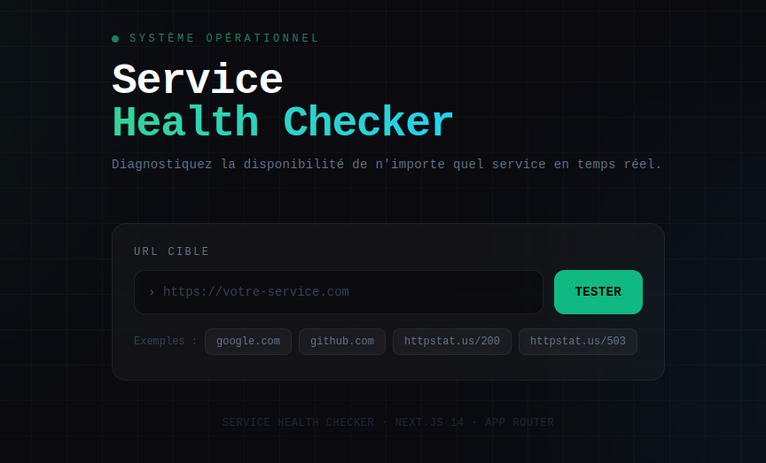
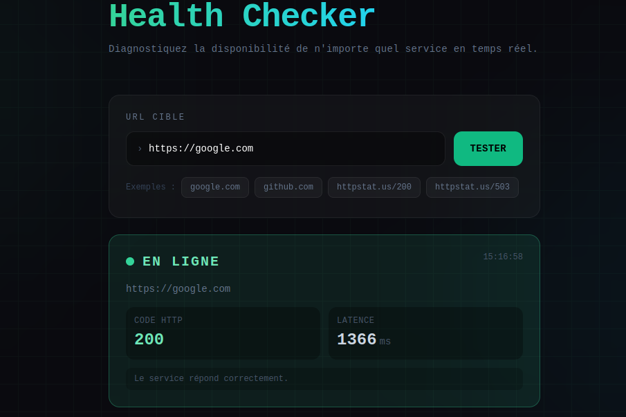
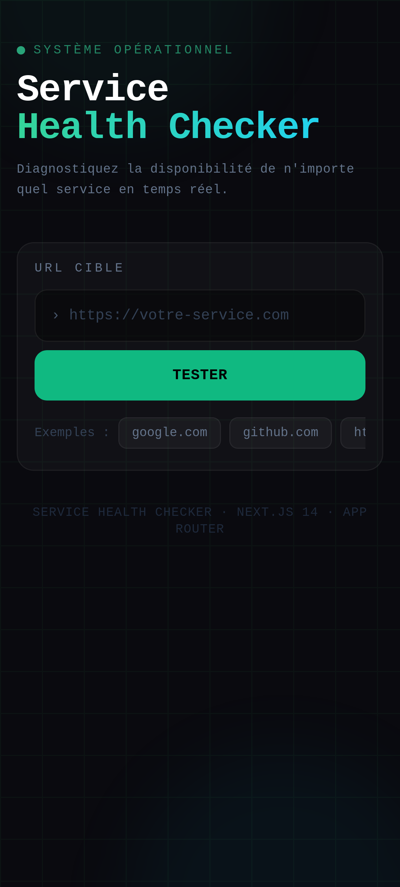
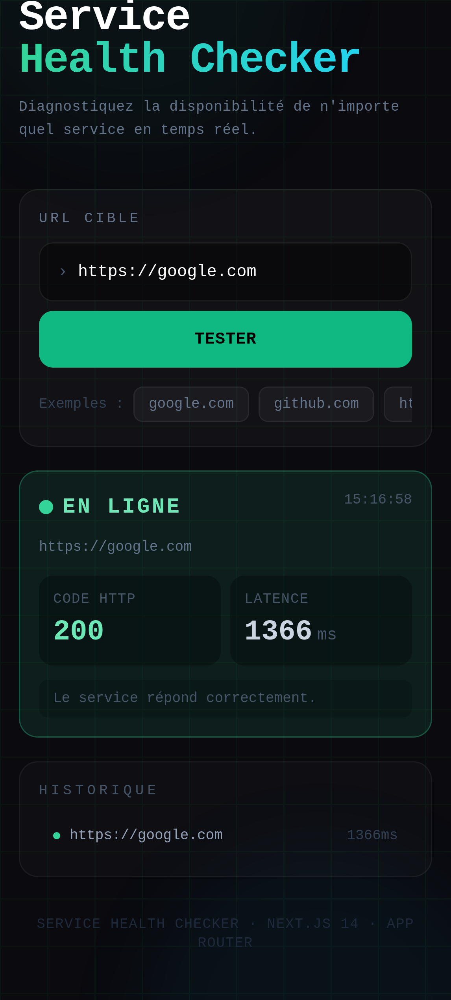

# Service Health Checker

Check if any web service is up or down — in real time.

[](https://service-health-checker.netlify.app)


## Description
Service Health Checker est une application web qui vérifie l'état de vos services en ligne et fournit un retour visuel rapide. Développée avec Next.js et Tailwind CSS, elle offre une interface réactive et moderne.

## Screenshots

### Desktop View



### Mobile View




---

## Stack

Next.js 14 · TypeScript · Tailwind CSS · Docker · GitHub Actions

## Features

- `GET /api/check?url=` — REST endpoint that returns status + latency
- 11 unit tests with Vitest
- Multi-stage Docker image (~150MB)
- CI/CD : tests → build → push to Docker Hub on every commit

## Run locally

```bash
npm install && npm run dev
```

## Test

```bash
npm test
```

---

Built by [nariveloson](https://github.com/nariveloson)
